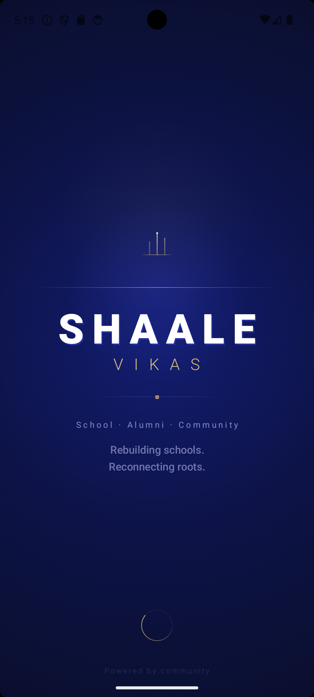
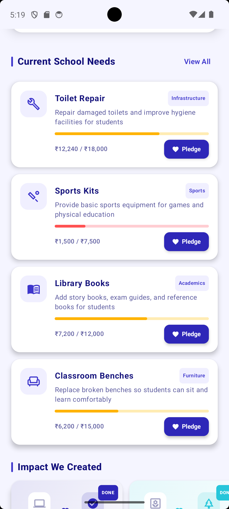
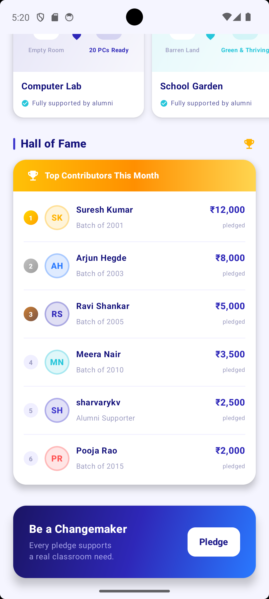

<div align="center">

# 🏫 Shaale-Vikas

### *Bridging Alumni and Schools — One Need at a Time*


> A transparent, community-driven platform empowering alumni to fund real infrastructure needs in their schools.

</div>

---

## 📌 Table of Contents

- [Introduction](#-introduction)
- [Problem Statement](#-problem-statement)
- [Screenshots](#-screenshots)
- [Features](#-features)
- [Tech Stack](#-tech-stack)
- [Architecture & Workflow](#-architecture--workflow)
- [Firebase Integration](#-firebase-integration)
- [Installation & Setup](#-installation--setup)
- [Running the App](#-running-the-app)
- [Folder Structure](#-folder-structure)
- [Future Enhancements](#-future-enhancements)
- [Conclusion](#-conclusion)

---

## 📖 Introduction

**Shaale-Vikas** (ಶಾಲೆ-ವಿಕಾಸ — *School Development*) is a School-Alumni Bridge platform built as a native Android application using **Kotlin** and **Jetpack Compose**. The platform connects school administrators with their alumni community, enabling targeted, transparent, and trackable micro-funding for real infrastructure needs.

Rather than broad donation drives, Shaale-Vikas focuses on **specific, tangible needs** — a broken classroom window, a shortage of library books, a leaking roof, new benches — giving alumni a clear picture of exactly where their support goes. Every pledge is tracked in real time, and recognition is built into the system through a transparent leaderboard.

---

## 🎯 Problem Statement

Government and semi-government schools in India, especially in rural and semi-urban areas, continue to face persistent infrastructure gaps despite public funding. Alumni of these institutions often wish to give back but lack:

- A **direct channel** to communicate with their former school
- **Visibility** into what is actually needed
- **Confidence** that their contribution creates measurable impact
- A way to see **real-time progress** on funded needs

Meanwhile, school administrators have no structured digital mechanism to broadcast specific needs, manage incoming pledges, or publicly acknowledge donors.

**Shaale-Vikas** solves this by creating a purpose-built bridge — giving administrators a dashboard to post and manage needs, and alumni a clean, engaging interface to browse, pledge, and track impact.

---

## 📸 Screenshots

### Splash Screen


### Landing Page


### Landing Page Variant


### Login Screen


### Alumni Dashboard


### Needs Dashboard


### Leaderboard


### Admin Dashboard


---

## ✨ Features

### 🔐 Authentication & Onboarding
- Animated splash screen with app branding
- Modern, responsive landing page with app introduction
- Secure login and registration system
- **Role-based authentication** — separate flows for Admin (Headmaster) and Alumni users

### 🛠️ Admin (Headmaster) Features
- Post new school needs with title, description, target amount, and category
- Mark specific needs as **urgent** for priority visibility
- Delete resolved or outdated needs
- Real-time sync — changes appear instantly on alumni dashboards
- Manage the school's public needs profile

### 👥 Alumni Features
- Browse all active school needs in a clean, card-based interface
- View real-time funding progress via **dynamic progress bars**
- Pledge support through a simulated digital pledge system
- Track cumulative contributions per need
- View the **Donor Hall of Fame** — a live leaderboard of top contributors
- Read **Impact Stories** — narratives of previously completed needs
- Secure, single-tap logout flow

### 📊 Platform-Wide Features
- Real-time Firestore sync between Admin and Alumni dashboards
- Dynamic progress tracking per need
- Community-owned transparency model
- Clean Material 3 UI with Jetpack Compose

---

## 🧰 Tech Stack

| Layer | Technology |
|---|---|
| **Language** | Kotlin |
| **UI Framework** | Jetpack Compose |
| **Design System** | Material 3 |
| **Authentication** | Firebase Authentication |
| **Database** | Firebase Firestore (NoSQL, real-time) |
| **IDE** | Android Studio |
| **Build System** | Gradle (Kotlin DSL) |
| **Architecture** | MVVM (Model-View-ViewModel) |

---

## 🏗️ Architecture & Workflow

Shaale-Vikas follows the **MVVM (Model-View-ViewModel)** architecture pattern, which cleanly separates UI, business logic, and data concerns.

```
┌─────────────────────────────────────────────────────────────┐
│                        USER LAYER                           │
│           Admin (Headmaster)     Alumni (Donor)             │
└──────────────────┬───────────────────────┬──────────────────┘
                   │                       │
┌──────────────────▼───────────────────────▼──────────────────┐
│                    UI LAYER (Jetpack Compose)                │
│    Splash → Landing → Auth → Role-based Dashboard           │
└──────────────────┬──────────────────────────────────────────┘
                   │
┌──────────────────▼──────────────────────────────────────────┐
│               VIEWMODEL LAYER (Business Logic)              │
│    AuthViewModel   │   NeedsViewModel   │   DonorViewModel   │
└──────────────────┬──────────────────────────────────────────┘
                   │
┌──────────────────▼──────────────────────────────────────────┐
│               DATA LAYER (Firebase Backend)                 │
│     Firebase Auth     │     Firebase Firestore              │
│   (User Identity)     │  (Needs, Pledges, Leaderboard)      │
└─────────────────────────────────────────────────────────────┘
```

### Application Flow

1. **App Launch** → Animated Splash Screen
2. **Landing Page** → User selects Login or Register
3. **Authentication** → Firebase Auth validates credentials
4. **Role Detection** → Firestore reads user role (`admin` / `alumni`)
5. **Dashboard Routing** → User is navigated to the appropriate dashboard
6. **Real-time Sync** → Firestore listeners push live updates to both dashboards simultaneously

---

## 🔥 Firebase Integration

Shaale-Vikas uses two Firebase services:

### Firebase Authentication
- Handles user registration and login with email/password
- Manages secure session persistence across app restarts
- Provides UID-based user identification for role mapping

### Firebase Firestore
The Firestore database is structured around the following collections:

```
firestore-root/
│
├── users/
│   └── {uid}/
│       ├── name: String
│       ├── email: String
│       └── role: "admin" | "alumni"
│
├── needs/
│   └── {needId}/
│       ├── title: String
│       ├── description: String
│       ├── targetAmount: Number
│       ├── raisedAmount: Number
│       ├── isUrgent: Boolean
│       └── createdAt: Timestamp
│
└── pledges/
    └── {pledgeId}/
        ├── uid: String
        ├── name: String
        ├── needId: String
        ├── amount: Number
        └── timestamp: Timestamp
```

- **Real-time listeners** (`snapshotListeners`) are attached to the `needs` and `pledges` collections, ensuring all dashboards reflect the latest state without manual refresh.
- Firestore **security rules** restrict write access to verified users and role-appropriate operations.

---

## ⚙️ Installation & Setup

### Prerequisites

- Android Studio **Giraffe (2022.3.1)** or later
- Android SDK **API Level 26+** (Android 8.0 Oreo and above)
- A **Firebase project** with Authentication and Firestore enabled
- A Google account for Firebase Console access

### Step 1 — Clone the Repository

```bash
git clone https://github.com/<your-username>/Shaale-Vikas.git
cd Shaale-Vikas
```

### Step 2 — Firebase Configuration

1. Go to the [Firebase Console](https://console.firebase.google.com/)
2. Create a new project (or use an existing one)
3. Register an Android app with your package name (e.g., `com.example.shaalevikas`)
4. Download the `google-services.json` file
5. Place `google-services.json` in the `/app` directory of the project

```
Shaale-Vikas/
└── app/
    └── google-services.json    ← Place here
```

6. In Firebase Console, enable:
   - **Authentication** → Email/Password sign-in method
   - **Firestore Database** → Start in test mode (configure rules before production)

### Step 3 — Open in Android Studio

1. Launch Android Studio
2. Select **File → Open** and navigate to the cloned folder
3. Wait for Gradle sync to complete
4. Ensure all dependencies resolve without errors

### Step 4 — Configure Firestore Security Rules *(optional for development)*

```
rules_version = '2';
service cloud.firestore {
  match /databases/{database}/documents {
    match /{document=**} {
      allow read, write: if request.auth != null;
    }
  }
}
```

> ⚠️ Tighten these rules before any production or public deployment.

---

## ▶️ Running the App

### On a Physical Device
1. Enable **Developer Options** and **USB Debugging** on your Android device
2. Connect the device via USB
3. Select your device from the target device dropdown in Android Studio
4. Click **Run ▶** or press `Shift + F10`

### On an Emulator
1. Open **Device Manager** in Android Studio
2. Create a Virtual Device with **API Level 26 or higher**
3. Start the emulator
4. Click **Run ▶** or press `Shift + F10`

### Test Credentials *(for development)*

| Role | Email | Password |
|------|-------|----------|
| Admin | headmaster@school.com | password123 |
| Alumni | alumni@school.com | password123 |

> Create these accounts manually via the registration screen or Firebase Console for first-time setup.

---

## 📁 Folder Structure

```
Shaale-Vikas/
│
├── app/
│   ├── google-services.json
│   └── src/
│       └── main/
│           ├── java/com/example/shaalevikas/
│           │   │
│           │   ├── model/                  # Data classes (User, Need, Pledge)
│           │   │   ├── User.kt
│           │   │   ├── Need.kt
│           │   │   └── Pledge.kt
│           │   │
│           │   ├── viewmodel/              # Business logic & Firestore interaction
│           │   │   ├── AuthViewModel.kt
│           │   │   ├── NeedsViewModel.kt
│           │   │   └── DonorViewModel.kt
│           │   │
│           │   ├── ui/                     # Composable screens & components
│           │   │   ├── splash/
│           │   │   │   └── SplashScreen.kt
│           │   │   ├── landing/
│           │   │   │   └── LandingPage.kt
│           │   │   ├── auth/
│           │   │   │   ├── LoginScreen.kt
│           │   │   │   └── RegisterScreen.kt
│           │   │   ├── admin/
│           │   │   │   └── AdminDashboard.kt
│           │   │   ├── alumni/
│           │   │   │   ├── AlumniDashboard.kt
│           │   │   │   ├── NeedsList.kt
│           │   │   │   ├── Leaderboard.kt
│           │   │   │   └── ImpactStories.kt
│           │   │   └── components/         # Reusable UI components
│           │   │       ├── NeedCard.kt
│           │   │       ├── ProgressBar.kt
│           │   │       └── DonorCard.kt
│           │   │
│           │   ├── navigation/             # NavHost & route definitions
│           │   │   └── AppNavigation.kt
│           │   │
│           │   └── MainActivity.kt
│           │
│           └── res/
│               ├── drawable/               # App icons and assets
│               ├── values/                 # Strings, colors, themes
│               └── font/                   # Custom fonts (if any)
│
├── screenshots/                            # App screenshots for README
├── build.gradle.kts
├── settings.gradle.kts
└── README.md
```

---

## 🚀 Future Enhancements

The following features are planned for upcoming development cycles:

- **UPI / Razorpay Payment Integration** — Move from simulated pledges to real digital payments
- **Push Notifications** — Alert alumni when a new urgent need is posted
- **Multi-School Support** — Allow alumni to follow and support multiple schools
- **Photo Evidence Upload** — Admins can upload before/after photos of completed needs
- **Offline Support** — Cache needs locally with Firestore offline persistence
- **Alumni Verification** — Batch/year-based alumni identity verification
- **OTP-based Login** — Phone number authentication via Firebase Auth
- **Analytics Dashboard** — Admin view of total raised, trends, and donor statistics
- **Social Sharing** — Share specific school needs to WhatsApp, Instagram, etc.
- **Multilingual Support** — Kannada, Hindi, and other regional languages

---

## 🏁 Conclusion

Shaale-Vikas demonstrates how mobile technology can serve as a meaningful bridge between communities and the institutions that shaped them. By combining the power of **Jetpack Compose** for a polished native UI, **Firebase** for seamless real-time data, and a role-based architecture that serves both administrators and alumni, the application addresses a genuine grassroots problem in a clean, scalable way.

This project was built as part of an academic initiative to explore how modern Android development practices can be applied to social impact use cases. It reflects the full lifecycle of a feature-rich Android application — from UI design and Firebase integration to role management and real-time data synchronization.

---

<div align="center">

**Built with ❤️ for schools and the alumni who never forgot them.**

*Shaale-Vikas — ಶಾಲೆ-ವಿಕಾಸ*

</div>
